# Omdo 2D Requirement

1. Brows : Left & Right (2 for each)
	Untuk brows perlu sheet berisi 2 tiap sisi(kiri kanan).
	1. Brows normal (biasa senang, semangat)
	2. Brows mengkerut (sedih, bingung, ngantuk)

2. Eye Left & Right (5 for each)
	Bagian mata dengan eyelid menjadi 1, tidak seperti 3d, dimana mata dan eyelid dipisah.
	1. Eye Normal
		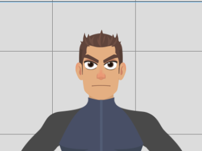
	2. Eye Squint
		
	3. Eye Close
		1. Close-Normal
			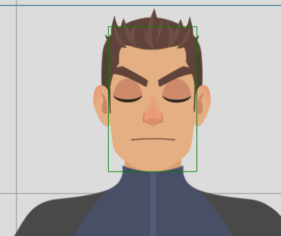
		2. Close-Smile
			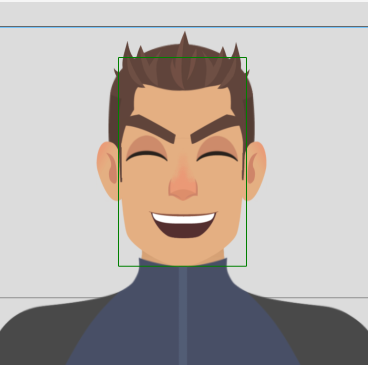
		3. Close-Scared
			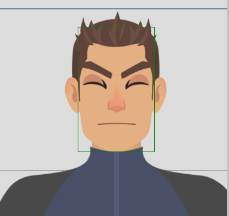
3. Nose : 1
	Hidung tidak beranimasi, cukup 1 saja.
4. Mouth : 12
	Berikut ini kebutuhan utama untuk mulut.
	1. Normal
	    
	3. Smile
		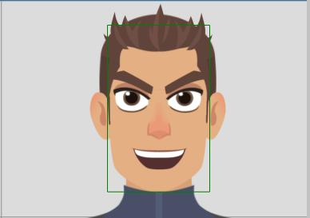
	3. OpenLip
		
	4. A
		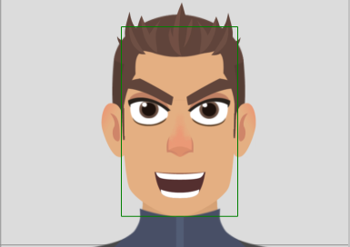
	5. I
		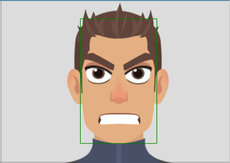
	6. U
		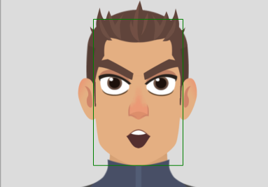
	7. E
		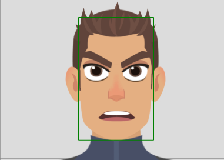
	8. O
        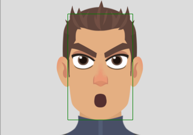
	9. FV
		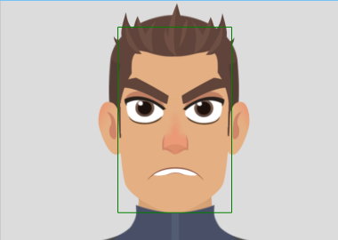
	10. Oh
		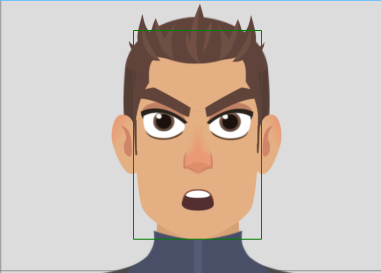
	11. LNDTh
		
	12. CDSKZ
		

6. Hair : 3
	- Untuk rambut ada tiga, sesuai karakter omdo, yang nantinya akan beranimasi mengikuti pergerak dari badan.
