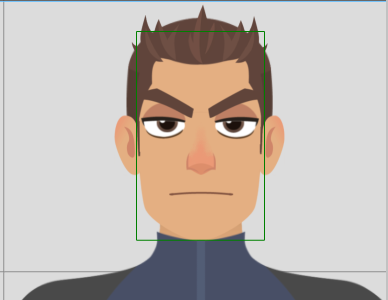

# Omdo 2D Requirement

1. Brows : Left & Right (2 for each)
	Untuk brows perlu sheet berisi 2 tiap sisi(kiri kanan).
	1. Brows normal (biasa senang, semangat)
	2. Brows mengkerut (sedih, bingung, ngantuk)

|   |   |   |   |   |
|---|---|---|---|---|
|   |   |   |   |   |
|   |   |   |   |   |
|   |   |   |   |   |

2. Eye Left & Right (5 for each)
	Bagian mata dengan eyelid menjadi 1, tidak seperti 3d, dimana mata dan eyelid dipisah.
	1. Eye Normal
		      
	2. Eye Squint
		      
	3. Eye Close
		1. Close-Normal
			      
		2. Close-Smile
			      
		3. Close-Scared
			      
3. Nose : 1
	Hidung tidak beranimasi, cukup 1 saja.
4. Mouth : 12
	Berikut ini kebutuhan utama untuk mulut.
	1. Normal
	          
	3. Smile
		      
	3. OpenLip
		      
	4. A
		      
	5. I
		      
	6. U
		      
	7. E
		      
	8. O
        	      
	9. FV
		      
	10. Oh
		      
	11. LNDTh
		      
	12. CDSKZ
		      

6. Hair : 3
	- Untuk rambut ada tiga, sesuai karakter omdo, yang nantinya akan beranimasi mengikuti pergerak dari badan.
